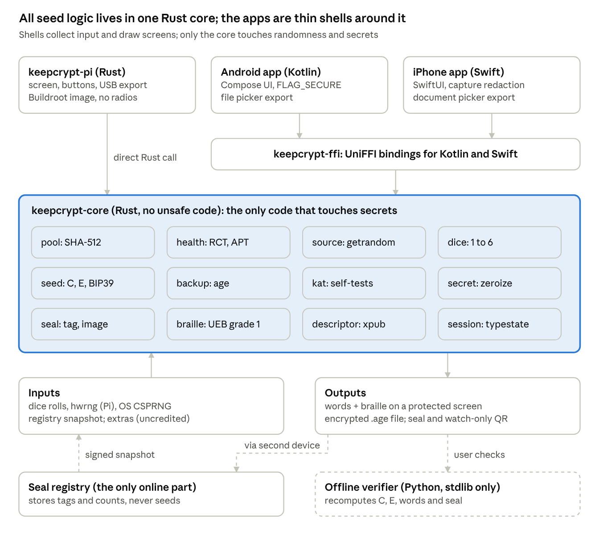

# Build plan for Claude Code

## How Claude Code uses this plan

KeepCrypt is one open-source repository: a shared Rust core that does all entropy and seed work, a bootable Raspberry Pi firmware, thin Android and iPhone apps over the same core, and a small public seal registry. Claude Code builds it milestone by milestone, stopping at each gate for your approval.

**Starter files to drop into the repo root** (delivered alongside this doc):

- `CLAUDE.md`: the rules Claude Code must follow on every task, including the banned-RNG list and the check-in gates.
- `tasks/todo.md`: the Milestone 0 and 1 plan as checkable items.
- `tasks/lessons.md`: empty log for corrections, with root cause and rule.
- `docs/`: export these five tabs as Markdown (`design.md`, `build-plan.md`, `pi-firmware.md`, `mobile-apps.md`, `seal-watchonly-braille.md`).
- `docs/KeepCrypt-SeedBook_Braille.pdf`: the owner's braille reference (insert format and the full word list), which the `braille` module must match.

**Working loop for every milestone.**

1. Claude Code reads `CLAUDE.md`, `tasks/lessons.md` and the milestone in `tasks/todo.md`.
2. It refines the milestone plan in `tasks/todo.md` and checks in with you before writing code.
3. It ticks items only after showing proof: test output, a screenshot of the simulator, or a reproduced hash.
4. At the milestone gate it stops and reports. You approve, or correct it, and every correction goes into `tasks/lessons.md`.

**First prompt to give Claude Code:**

```text
Read CLAUDE.md, every file in docs/, and tasks/todo.md.
Then refine Milestone 0 in tasks/todo.md and check in with me before writing any code.
```

## System architecture

Every platform links the same `keepcrypt-core`; a fix or an audit of the core covers the Pi, Android and iPhone at once.



The Pi firmware calls the core directly as a Rust crate; the phone apps go through generated UniFFI bindings. The dashed verifier runs on a separate offline computer and needs nothing from KeepCrypt except the published algorithm. The seal registry is reached only by a second device or a downloaded snapshot, so the devices themselves stay offline.

## Repository layout and toolchain

One Rust core, compiled for every target, keeps the security-critical code in one auditable place. Everything else is a shell around it.

```text
keepcrypt/
├─ CLAUDE.md                  rules for Claude Code
├─ tasks/todo.md, lessons.md  plan and corrections log
├─ docs/                      design, build plan, firmware, mobile, seal and braille
├─ core/                      keepcrypt-core: pool, health, dice, seed, seal, braille, descriptor, backup
├─ ffi/                       keepcrypt-ffi: UniFFI bindings for Kotlin and Swift
├─ pi/
│  ├─ app/                    keepcrypt-pi: display, buttons, screens, QR, USB export and snapshot import
│  ├─ sim/                    desktop simulator of the 240x240 screen and keys
│  └─ os/                     Buildroot external tree, defconfig, overlays
├─ mobile/
│  ├─ android/                Kotlin + Jetpack Compose
│  └─ ios/                    Swift + SwiftUI
├─ registry/
│  ├─ server/                 seal registry: Rust, axum, SQLite, transparency log, snapshot signer
│  └─ web/                    static checking and registration page
├─ templates/                 printable insert worksheet in SeedBook format (SVG, PDF)
├─ tools/
│  ├─ verify/                 offline verifier, Python 3 standard library only
│  └─ entropy-lab/            raw-sample capture for NIST ea_non_iid
├─ vectors/                   BIP39, age, seal, braille and KeepCrypt test vectors (JSON)
└─ .github/workflows/         CI: tests, audits, reproducibility
```

| Area | Choice | Why |
| --- | --- | --- |
| Core language | Rust stable, pinned in `rust-toolchain.toml`; `#![forbid(unsafe_code)]` in `core/` | Memory safety; one implementation for every platform |
| Pi target | `arm-unknown-linux-gnueabihf` (Pi Zero v1.3 is ARMv6), built inside Buildroot | Matches the radio-less Pi Zero; reproducible toolchain |
| Android | Kotlin, Jetpack Compose, `cargo-ndk`, minSdk 31 | API 31 adds overlay hiding; FLAG\_SECURE is less reliable on 30 and below |
| iOS | Swift, SwiftUI, XCFramework from `cargo` + UniFFI, iOS 17+ | iOS 17 adds `sceneCaptureState` for capture detection |
| Bindings | Mozilla UniFFI | Generates Kotlin and Swift from one Rust interface |
| Core crates | `getrandom`, `sha2`, `bip39`, `bitcoin` (fingerprint, address), `miniscript` (descriptors), a BC-UR encoder (watch-only QR), `age` (scrypt), `zeroize`, `secrecy`, `thiserror` | Small, widely reviewed; nothing else without review |
| Pi crates | `rppal` (GPIO, SPI), `mipidsi` (ST7789), `embedded-graphics`, `embedded-graphics-simulator` (sim only) | Userspace drivers, testable on a desktop |
| Verifier | Python 3, standard library only | Anyone can read and run it offline |
| Dependency hygiene | `Cargo.lock` committed, `cargo-deny`, `cargo-audit`, `cargo-vet` | Supply-chain control; Coldcard's bug came from a submodule |
| Registry | Rust (axum, SQLite) server; static TypeScript page with no third-party scripts | The only networked component; small enough to audit |

## Core crate specification

`keepcrypt-core` owns every byte of randomness and every secret; the Pi and phone shells only collect inputs and draw screens. A typestate session makes the wrong order of operations fail to compile.

**Modules.**

| Module | Responsibility |
| --- | --- |
| `pool` | SHA-512 pool; absorbs records as source id (u16), length (u64, big-endian), data |
| `health` | Repetition Count, Adaptive Proportion and startup tests on raw samples |
| `source` | Source ids and credit policy; reads `getrandom()` itself so no shell can skip it |
| `dice` | Roll validation (1 to 6 only), entropy count at 2.585 bits per roll, ASCII string |
| `seed` | Commitment C, combine E, dice-only E, BIP39 encoding, fingerprint and first address via rust-bitcoin |
| `backup` | age encryption with an scrypt passphrase; generated 8-word backup passphrases |
| `kat` | Known-answer tests for SHA-256, SHA-512, BIP39, age, seal and braille, run on every session start |
| `secret` | Zeroizing wrappers with no `Debug`, `Display`, `Clone` or `Serialize` |
| `seal` | Seal code, tag, ID and 8x8 image from the BIP39 seed; check nonce and go-ahead code; snapshot and bucket-proof verification and lookup |
| `braille` | SeedBook format: grade 1 cells, faces 1–5 with blanks, SeedBook numbers (1-based), mirror-pair flags, metal read-back check, number sign for passphrases |
| `descriptor` | BIP84 account key, receive and change descriptors with checksums, BC-UR account export |

**Public API (sketch for Claude Code to refine, not final code):**

```rust
pub enum SeedLength { Words12, Words24 }   // default Words12: one KeepCrypt Hinge or Screw
pub enum Mode { Mixed, DiceOnly }
pub enum Platform { Pi, Phone }

// Typestate: Collecting -> Committed -> Rolling -> Sealed -> (Checking) -> Ready
impl Session<Collecting> {
    pub fn new(len: SeedLength, mode: Mode, platform: Platform) -> Result<Self, CoreError>; // runs KATs
    pub fn add_hw_samples(&mut self, raw: &[u8]) -> Result<(), CoreError>; // health-tested, credited
    pub fn add_extra(&mut self, source: SourceId, bytes: &[u8]);           // mixed, never credited
    pub fn commit(self) -> Result<Session<Committed>, CoreError>;          // reads getrandom(64); fails if quota unmet
}
impl Session<Committed> {
    pub fn commitment(&self) -> [u8; 32];            // C, safe to display
    pub fn start_dice(self) -> Session<Rolling>;
}
impl Session<Rolling> {
    pub fn push_roll(&mut self, face: u8) -> Result<(), CoreError>;
    pub fn undo_roll(&mut self);
    pub fn finish(self) -> Result<Session<Sealed>, CoreError>;   // fails below the minimum: 50, 99, or 99 after a collision
}
// Sealed: the seed exists, but no mnemonic, D, backup or export can leave this state.
impl Session<Sealed> {
    pub fn seal(&self) -> SealPublic;                              // tag T, Seal ID, 8x8 image
    pub fn skip_check(self) -> Session<Ready>;                     // "Skip": offered only before a check starts
    pub fn start_check(self) -> Result<Session<Checking>, CoreError>; // draws a fresh 8-byte nonce n
}
// Checking: the same secrecy as Sealed, and no way back to Skip.
impl Session<Checking> {
    pub fn check_request(&self) -> CheckRequest;                   // seal card and check QR URL with T and n
    pub fn reveal(self, go: GoAhead) -> Result<Session<Ready>, Rejected>; // only a verified go-ahead reaches the words
    pub fn discard(self, why: Discard) -> Wiped;                   // Stop or Cannot check: wipes the seed
}
pub enum GoAhead { Snapshot(VerifiedSnapshot), BucketProof(Vec<u8>), Code(String) }
pub enum Rejected { Retry(Session<Checking>, CheckError), Collision(Wiped) } // typo or bad scan, or a proven match
pub enum Discard { Collision, CannotCheck }
impl Wiped {
    pub fn collision_report(&self) -> Option<CollisionReport>;    // the seal code to report, only after a collision
    pub fn restart(self, len: SeedLength, mode: Mode) -> Result<Session<Collecting>, CoreError>; // fresh legs; 99-roll minimum after a collision
}
impl Session<Ready> {
    pub fn mnemonic(&self) -> &SecretMnemonic;
    pub fn braille(&self) -> BrailleInserts;                      // faces 1-5, blanks, SeedBook numbers, mirror flags
    pub fn check_readback(&self, position: u8, first_four: &str) -> ReadbackResult; // metal read-back, per insert
    pub fn fingerprint(&self) -> [u8; 4];
    pub fn first_address(&self) -> String;                        // BIP84 m/84'/0'/0'/0/0
    pub fn watch_only(&self, bip39_passphrase: Option<&SecretStr>) -> WatchOnlyExport; // UR account + descriptors
    pub fn registration(&self) -> SealRegistration;               // seal code and register URL, shown as QR
    pub fn reveal_device_leg(&self) -> SecretBytes32;             // D, for offline audit
    pub fn encrypt_backup(&self, pass: &BackupPassphrase) -> Result<Vec<u8>, CoreError>;
}
pub fn generate_backup_passphrase() -> Result<BackupPassphrase, CoreError>; // 8 BIP39 words, 88 bits
pub fn decrypt_backup(file: &[u8], pass: &BackupPassphrase) -> Result<SecretMnemonic, CoreError>;
pub fn verify_snapshot(file: &[u8]) -> Result<VerifiedSnapshot, CoreError>;  // pinned Ed25519 key; bucket root recomputed
pub fn seal_from_mnemonic(m: &SecretMnemonic) -> SealPublic;                // for later re-checks
```

**Credit policy.**

| Platform | Device leg is satisfied by | User leg (Mixed mode) |
| --- | --- | --- |
| Pi | `getrandom(64)` plus 512 credited bits of raw `/dev/hwrng` output that passed the startup and continuous health tests; hwrng is credited at 4 bits per byte until lab data sets a measured value | 99 rolls (24 words) or 50 (12 words) |
| Phone | `getrandom(64)`; phones expose no raw noise source | Same |
| Dice-only, any | Not used; screen states that no device randomness is mixed in | Same |

**Invariants Claude Code must preserve and test.**

- Nothing between pool and seed is narrower than 256 bits.
- Domain tags are fixed: `KCE/v1/pool`, `KCE/v1/commit`, `KCE/v1/seed`.
- E = SHA-256(`KCE/v1/seed` ‖ D ‖ len(R) as u64 big-endian ‖ R); dice-only E = SHA-256(R), matching Coldcard.
- Every function that touches randomness returns `Result`; there is no default or fallback value anywhere.
- Secrets are wiped on drop; the session wipes itself on any error.
- In the sealed state no function returns the mnemonic, D, a backup or an export; compile-fail tests prove it.
- The seal is computed from the BIP39 seed only, never from public keys. Once a check starts, only a verified go-ahead reaches the words; Skip exists only before it.

## Encrypted backup format

The only digital export is a standard [age v1](https://age-encryption.org/v1) file with a single scrypt passphrase stanza, so any user can decrypt it years later with the open-source `age` tool, without KeepCrypt. Paper words stay the primary backup.

| Field | Value |
| --- | --- |
| Container | age v1, ASCII-armored (`-----BEGIN AGE ENCRYPTED FILE-----`) |
| Recipient | scrypt only; the spec forbids mixing it with other stanzas |
| Work factor | log2 N = 18 (about 256 MiB of memory), so a 512 MB Pi Zero can still decrypt |
| Cipher | ChaCha20-Poly1305 with a fresh 16-byte file key and nonce per file, per the spec |
| Passphrase | Generated by the core: 8 words from the BIP39 English list, 88 bits; shown once, written on paper, stored apart from the file |
| File name | `keepcrypt-backup-<8 random hex>.age`; no fingerprint or date in the name |

**Plaintext inside the file** (UTF-8, versioned so future readers know the layout):

```text
keepcrypt-backup/v1
words: <12 or 24 BIP39 words>
braille:
  01 ⠁⠃⠁⠝⠙⠕⠝
  <one line per word: two-digit position, space, every letter of the word in cells>
fingerprint: <8 hex>
created-by: keepcrypt-pi 1.0.0 | keepcrypt-android 1.0.0 | keepcrypt-ios 1.0.0
```

**Rules.**

- The BIP39 passphrase, if the user has one, is never written into the backup.
- After writing, the app reads the file back, decrypts it in memory and compares the fingerprint before reporting success.
- User-chosen backup passphrases are not offered in v1; a weak one would make the file the easiest attack.
- The test-vector suite includes files produced by the reference `age` tool, decrypted by the core, and the reverse.

## Security rules enforced in CI

Every rule below is checked by a machine on every pull request, because the Coldcard bug passed human review for five years.

| Rule | How CI enforces it |
| --- | --- |
| Only `getrandom` supplies OS randomness | `cargo-deny` bans `rand`, `fastrand`, `oorandom`, `nanorand` and similar crates in `core/`; Clippy `disallowed-methods` and a grep gate reject `Math.random`, `java.util.Random`, `arc4random_uniform` in app code |
| One RNG path in shipped binaries | Symbol check on release binaries: libc `getrandom` is imported, and no other RNG symbol (`rand`, `random`, `drand48`, `arc4random`) appears |
| Test stubs never ship | Stubs live behind a `test-sources` feature; CI builds release artifacts with `--no-default-features` and greps them for the marker, a positive check rather than a `#ifndef`-style guard |
| No unsafe code in the core | `#![forbid(unsafe_code)]` in `core/` |
| Secrets never printed | Secret types implement no `Debug` or `Display`; a test formats every public type and asserts no BIP39 word appears; `core/` has no logging dependency |
| Fail closed | Clippy `disallowed-methods` bans `Result::unwrap_or`, `unwrap_or_default` and `unwrap_or_else` inside `core/`; tests inject every error and assert the session halts |
| Known answers | BIP39 `vectors.json`, Coldcard `rolls.py` outputs, age test kit and KeepCrypt vectors run on every build |
| Supply chain | Locked dependencies, `cargo-audit` and `cargo-vet`; new crates need a reviewed `vet` entry |
| Review | `CODEOWNERS` requires two approvals for `core/`, `ffi/` and `pi/os/` |
| Nothing secret leaves before the seal check | Compile-fail tests: the sealed and checking states have no mnemonic, D, backup or export functions, and the checking state has no skip |
| Seal derived from the seed only | The seal function's only input is the BIP39 seed; vectors pinned in `vectors/seal.json` |
| Registry keeps no IPs or seal codes | Schema test: no IP, user-agent or code column; deployment test: proxy access logs off |
| Only authentic snapshots are used | Tests reject bad signatures, wrong keys, truncated bodies and unsorted entries |

## Milestones and acceptance gates

Build the core and the verifier first; every app is a thin shell that cannot start until the core passes its gate. Claude Code stops at each gate and waits for your approval.

| # | Milestone | Deliverables | Gate: proof required before moving on | Needs |
| --- | --- | --- | --- | --- |
| M0 | Repo bootstrap | Cargo workspace, CI skeleton, `cargo-deny` config, `CLAUDE.md`, `vectors/` | CI green; core cross-compiles for Pi Zero, Android and iOS targets | none |
| M1 | Core crate | All modules in the spec, typestate session, KATs, error injection | All vectors pass; source-substitution and error-injection tests pass; at least 95% line coverage in `core/` | M0 |
| M2 | Offline verifier | `tools/verify/verify.py`, KeepCrypt vectors, age interop files | Verifier and core agree on 1,000 generated cases, including seal codes and braille; dice-only output matches Coldcard `rolls.py` | M1 |
| M3 | Pi app on simulator | Every screen including seal check with go-ahead code entry and braille pages, button handling, waiting-screen game, USB export and snapshot import mocked | Scripted run drives a full ceremony in the simulator; you review the screen captures | M1 |
| M4 | Pi hardware and OS image | ST7789 and button drivers, hwrng reader, Buildroot image, USB export | Full ceremony on a Pi Zero v1.3, checked with the offline verifier; two clean builds give the same image hash; the watch-only QR imports into Sparrow and Bitcoin Core with the same first address | M3 |
| M5 | Android app | Compose UI over the FFI, capture protection, backup via file picker | Screenshot and recording tests come back blank; merged manifest has no INTERNET permission; backup round trip passes; snapshot import and Sparrow watch-only import work; a go-ahead QR from the test registry reveals the words and a Stop wipes them | M1, M2 |
| M6 | iPhone app | SwiftUI over the FFI, capture handling, backup via document picker | Words hide during recording and mirroring; a screenshot discards the session; App Privacy Report shows no network use; snapshot import and Sparrow watch-only import work; a go-ahead QR from the test registry reveals the words and a Stop wipes them | M1, M2 |
| M7 | Hardening and audit | Birthday-collision job, signed reproducible releases, SBOM, threat-model review | External auditor signs off; a third party reproduces the Pi image and Android APK | M4, M5, M6 |
| M8 | Phase-2 entropy | External TRNG, camera/mic/IMU extras, entropy-lab captures | Credits backed by `ea_non_iid` data; tests prove extras can never satisfy a quota | M4 |
| M9 | Seal registry | Registry server, checking page and offline checker app, bucket-proof files, transparency log, daily signed snapshots | A duplicated test seed is stopped by a loaded snapshot, the website and the offline checker app on every platform; go-ahead codes and QRs reveal words only for clear seals; a collision report raises the count; schema and proxy config hold no IPs or codes | M1 |

Detailed tasks for M0 and M1 are in the starter `tasks/todo.md`. Claude Code expands each later milestone into `tasks/todo.md` when it starts, and checks in before coding.

## Test and verification matrix

Each test exists to catch one specific way seed generation has failed in the real world.

| Test | Layer | Runs | Catches |
| --- | --- | --- | --- |
| BIP39, age and SHA known-answer vectors | Core | Every build and every session start | Broken encoding or crypto library |
| Coldcard `rolls.py` cross-check | Core, verifier | Every build | Dice-only math drifting from the de facto standard |
| Source-substitution | Core | Every build | A source that never reaches the pool (the Coldcard bug) |
| Error injection on every source | Core | Every build | Fallbacks and fail-open exception handlers |
| Repetition Count and Adaptive Proportion with known stuck and biased streams | Core | Every build | Health tests that never fire |
| Typestate misuse | Core | Every build (`trybuild` compile-fail tests) | Dice before commitment; reveal before finish |
| Birthday collision, 1,000,000 device legs | Core, Pi | Nightly | A state narrower than about 36 bits |
| Symbol and stub-marker scan | Release artifacts | Every release build | Wrong RNG linked; test stubs shipped |
| Verifier agreement, 1,000 cases | Verifier | Every build | Core and verifier disagreeing |
| Screen-capture tests | Android, iOS | Every app build on real devices | Seed words reaching a screenshot, recording or app switcher |
| No-network checks | Android manifest, iOS privacy report | Every app build | Networking code or an SDK added later |
| Reproducible build | Pi image, Android APK | Every release | A release that does not match its source |
| Full ceremony with offline verification | Pi, Android, iOS | Before every release | Anything the unit tests missed |
| Seal, braille and descriptor vectors | Core, verifier | Every build | Seals or braille differing between platforms; wrong descriptor checksums |
| Sealed-state compile-fail tests | Core | Every build | Words, D or exports reachable before the collision check |
| Snapshot tampering | Core | Every build | Forged or truncated registry snapshots accepted |
| Duplicate-seed drill | Registry, Pi, Android, iOS | Before every release | A registered seed not caught end to end, or words shown after a match |
| Watch-only import into Sparrow and Bitcoin Core | Pi, Android, iOS | Before every release | Exported descriptors not matching the wallet's first address |
| Metal read-back drill | Pi, Android, iOS | Before every release | A mirror-pair misread (e/i, d/f, h/j, r/w) or a missed blank face accepted as correct |
| Go-ahead vectors and tampering | Core, checker page | Every build | A code for another seal or nonce accepted; a forged, truncated or wrong-bucket proof accepted; words reachable from the checking state without a go-ahead |

## Release, reproducible builds and audit

A release is a set of artifacts anyone can rebuild bit for bit and check against signed hashes. Where that is not yet possible (iOS), the docs say so plainly.

| Artifact | Reproducible? | How |
| --- | --- | --- |
| Pi image (`keepcrypt-pi-<version>.img`) | Yes | Pinned Buildroot release, pinned Rust toolchain, `SOURCE_DATE_EPOCH`; CI builds twice and compares SHA-256 |
| Android APK | Yes, target | Deterministic Gradle settings; publish through F-Droid, which rebuilds from source; signed APK on GitHub releases |
| iOS app | No | App Store re-signs binaries; publish source, exact Xcode version and build steps; recommend the Pi or Android for highest assurance |
| Offline verifier | Trivially | A single Python file; its SHA-256 is printed in the release notes |

**Every release ships:** SHA-256 sums signed with the project's release key (minisign or GPG), an SBOM, the changelog, and the exact command to reproduce each artifact.

**Registry operations:** the snapshot signing key is kept offline and its public half is pinned in every app. The registry deploys from the same repository with reproducible server builds, and mirrors republish every signed snapshot and tree head.

**Before 1.0:** an independent security audit of `core/`, `ffi/`, the Pi image build and both apps' capture and backup code; fixes published with the report.

**After 1.0:** a public bug bounty, a `SECURITY.md` with a disclosure address, and a pre-written advisory template. If an entropy bug is ever found, the advisory lists affected versions, how to tell whether a seed is affected, and migration steps, the way Coinkite had to on day one.
