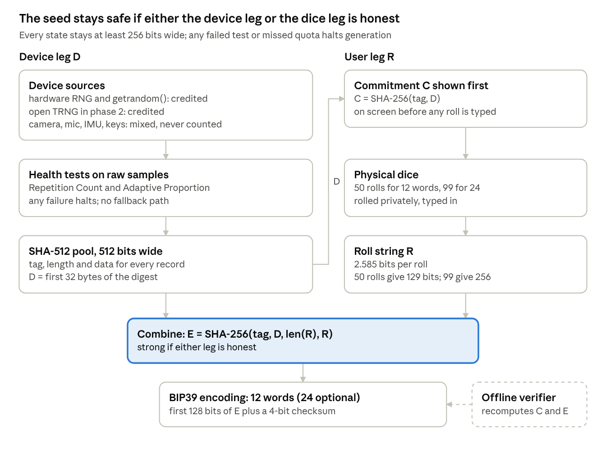

# KeepCrypt-Entropy: Seed Entropy Design

Oct 9, 2026 · @SKINOX

Implementation docs: Build plan for Claude Code · Pi firmware · Mobile apps · Seal, watch-only and braille

## Summary

The July 2026 Coldcard theft was not caused by too few entropy sources: a build error sent seed generation to a non-cryptographic PRNG, and newer models mixed three sources but squeezed them through a 32-bit state. KeepCrypt-Entropy should therefore focus on a provably wide, testable, user-verifiable pipeline, with your sensors and games as extras rather than the foundation.

**Recommendations.**

1. **Two credited legs, one hash.** A device leg (hardware RNG plus `getrandom()`, health-tested) and a dice leg (50 fair d6 rolls for 12 words, 99 for 24) combined with SHA-256. The seed stays safe if either leg is honest.
2. **Keep your sensor and game ideas, credited at zero.** Camera, mic, gyro and keypress timing go into the pool as insurance. Game pieces must use a separate RNG and never display pool-derived values. Guided dice entry gives users the same hands-on role with real, checkable entropy.
3. **Never narrow the pipe; never use a non-cryptographic RNG; fail closed.** Each of the Coldcard, Milk Sad, LuBian and Randstorm failures broke at least one of these rules.
4. **Prove the path in CI.** Source-substitution, symbol-audit and birthday-collision tests catch a seed path that silently skips the TRNG.
5. **Let users verify.** Show a commitment before dice, reveal the device value on request, and ship an offline verifier. Offer a dice-only mode compatible with Coldcard's math.
6. **Hardware:** a radio-less Raspberry Pi Zero v1.3 for phase 1; an open-source noise source (Infinite Noise TRNG or your own avalanche board) in phase 2.

**One honest caveat.** No design can be proven "non-hackable." The achievable, stronger claim is: open, reproducibly built, externally audited, and checkable by every user with dice and an offline computer.

## What actually went wrong

Every major weak-entropy theft, Coldcard included, was a software path that never reached real randomness or squeezed it through a tiny seed. None was caused by too few sensors.

### Coldcard, July 2026

Attackers swept 1,082.65 BTC from 1,196 addresses in a 41-minute window on July 30, 2026; tracked losses grew to at least 1,367 BTC (about $88.6M) across 4,585 addresses within days ([Infosecurity](https://infosecurity-magazine.com/news/coldcard-users-lose-89m-bitcoin)). Keys were recomputed offline; no device was touched ([Coinkite backgrounder](https://blog.coinkite.com/entropy-technical-backgrounder/)).

The failure chain, from [Coinkite](https://blog.coinkite.com/entropy-technical-backgrounder/) and [Block's independent analysis](https://engineering.block.xyz/blog/predictable-rng-fallback-and-32-bit-reseed-in-coldcard-firmware):

1. **A refactor moved the seed path.** In March 2021, seed generation switched from the hardware-RNG call to a new library call during a migration to libsecp256k1.
2. **A one-character build guard failed silently.** The board set `MICROPY_HW_ENABLE_RNG` to 0. The library guard used `#ifndef`, which only checks that the macro exists, so its `#error` never fired.
3. **The linker picked the wrong function.** `rng_get()` resolved to MicroPython's non-cryptographic Yasmarang PRNG, seeded from the chip UID, a SysTick counter and RTC registers. Same signature, so the build passed.
4. **XOR with a second PRNG added nothing.** The library XORed it with another Yasmarang whose seed is a public constant. Two reproducible streams XOR to a reproducible stream.
5. **The health check tested the wrong thing.** It only rejected repeated adjacent outputs, which any PRNG passes.
6. **Newer models did combine sources, then threw them away.** Mk4, Q and Mk5 hashed 40 bytes from two secure elements, kept 4 bytes, and overwrote one 32-bit state word. At most 2^32 distinct output streams survived.
7. **Final hashing could not repair it.** SHA-256d makes output look uniform, but 2^32 inputs still give at most 2^32 seeds. The BIP39 checksum adds no entropy either.

Coinkite estimates roughly 40 bits of effective entropy on Mk2/Mk3 and 72 bits on Mk4, Mk5 and Q; Block found Mk2/Mk3 fully deterministic once the UID and timers are known. The firmware was open source for five years, and an AI code review weeks earlier missed it ([Coinkite](https://blog.coinkite.com/entropy-technical-backgrounder/)).

**Who survived:** seeds made with at least 50 private dice rolls, and wallets behind a strong, unique BIP39 passphrase ([Bitcoin Optech](https://bitcoinops.org/en/newsletters/2026/07/31/)). The fix added a build-time check that fails unless the board TRNG supplies `rng_get()`. Later firmware requires user-supplied entropy mixed with device randomness ([Cointelegraph](https://regional-front.cointelegraph.com/news/coldcard-upgrade-strengthen-seed-phrase-generation)).

**The lesson for your multi-source idea:** Coldcard Mk4 already mixed three sources. It still failed because one stage narrowed the state to 32 bits. Adding sources only helps if every byte reaches a wide, cryptographic pool.

### Earlier incidents, same pattern

| Disclosed | Incident | What went wrong | Impact |
| --- | --- | --- | --- |
| Aug 2025 | [LuBian mining pool](https://www.theblock.co/post/365336/bitcoin-now-worth-14-5-billion-quietly-stolen-from-chinese-mining-pool-in-2020-arkham) (theft Dec 2020) | Brute-forceable key generation, reported as 32-bit entropy | 127,426 BTC, about $3.5B at the time |
| Nov 2023 | [Randstorm](https://www.unciphered.com/blog/randstorm-you-cant-patch-a-house-of-cards) (BitcoinJS, wallets from 2011 to 2015) | JSBN `SecureRandom()` leaned on weak browser `Math.random()` | Up to $2.1B estimated at risk |
| Aug 2023 | [Milk Sad, CVE-2023-39910](https://nvd.nist.gov/vuln/detail/CVE-2023-39910) (Libbitcoin Explorer `bx seed`) | Mersenne Twister seeded with 32 bits | Exploited in the wild, June to July 2023 |

## Threat model

Design against an attacker who has your source code, an identical device to profile, every address on the blockchain, and years of GPU time. That is exactly the Coldcard attacker.

| Attacker | What they have | What they try | Primary defense |
| --- | --- | --- | --- |
| Offline brute-forcer | Your open-source code, a cloned device, public addresses as a match oracle, large compute | Enumerate the seed space and check derived addresses | At least 128 bits (prefer 256) of real min-entropy reaching a wide cryptographic pool |
| Malicious firmware or supply chain | Control of the code that runs on the device | Ignore user entropy and emit an attacker-known seed, or leak the seed later | User-verifiable dice mode, reproducible builds, signed releases, anti-exfil signing |
| Local observer | A camera, microphone or person near the device | Capture dice rolls, the screen, or the seed words | Private setup, no network radios, screen hygiene |
| Sensor manipulator | Physical proximity | Inject sound, light, vibration or EM to bias a sensor | Never trust one environmental source; credit sensors near zero |
| Forensic examiner | The device later | Recover the seed from SD card, swap, logs or RAM | Read-only OS, no swap, RAM-only secrets, zeroize after use |

**What the numbers mean.** About 2^40 candidates is a laptop afternoon. 2^72 needs serious resources but is not a margin for decades of family savings. 2^128 is out of reach for any foreseeable classical computer, and 256 bits (24 words) keeps a margin even against future quantum search.

**Out of scope for entropy:** phishing, seed-backup theft, and $5-wrench attacks. A passphrase and multisig address those.

## Core principles

Strong seed entropy comes from a short, testable pipeline, not from piling on sources. Each rule below maps to a real failure.

1. **Entropy belongs to the process, not the output.** Hashed or PRNG output passes every statistical test, including Coldcard's Yasmarang. Measure the raw physical samples before any hashing.
2. **Credit min-entropy conservatively.** Count only what a source's physics guarantees under attack, estimated on raw data the way [NIST SP 800-90B](https://csrc.nist.gov/pubs/sp/800/90/b/final) prescribes. Most sensors deserve far less credit than their bit count suggests.
3. **Never narrow the pipe.** Keep at least 256 bits of state from pool to seed. No 32-bit seeds, no truncation, no integer casts. This killed Milk Sad, LuBian and Coldcard Mk4.
4. **Only cryptographic primitives.** Pool with SHA-512 or BLAKE2b; expand with a standard DRBG if needed. Never Mersenne Twister, `rand()`, `Math.random()`, Yasmarang or a language's default `Random`.
5. **Hash-concatenate sources, never XOR them raw.** A length-prefixed hash of all inputs stays strong if any one input is unpredictable. Raw XOR lets a correlated or hostile source cancel the others.
6. **Fail closed.** If a required source is missing, unhealthy or short of its quota, refuse to make a seed. No silent fallback, no broad exception handler that continues.
7. **Test the path, not the presence.** Prove at build time and run time that the seed function actually reaches the TRNG. Coldcard's TRNG code was in the binary; the seed path never called it.
8. **Let the user verify.** Offer a dice mode the user can recompute on another machine. This is the only defense that survives a malicious or buggy device.
9. **Every source is also attack surface.** Bugs, not physics, caused every theft above. Prefer fewer, well-tested sources over many clever ones.

## Evaluating the proposed sources

Keep the multi-source idea, but credit only two legs: the hardware RNG and physical dice. Mix the sensors and games in as uncredited extras, because each is weak, correlated or attacker-influenced.

| Source | Where real randomness comes from | How it fails or gets attacked | Credit toward the quota |
| --- | --- | --- | --- |
| Physical dice (d6, casino-grade) | Mechanical chaos of each throw | Biased dice, rolls seen by a camera, user skipping rolls | Full: 2.585 bits per fair roll; 50 rolls give 129 bits, 99 give 256 |
| SoC hardware RNG (`/dev/hwrng`) | On-chip noise circuit: the BCM2835 RNG on the Pi Zero, iProc RNG200 on the Pi 4 and 5 ([Zephyr driver](https://git.data.coop/pedersen/zephyr/src/branch/main/drivers/entropy/entropy_iproc_rng200.c)) | Closed, unauditable design; driver or binding silently swapped, as at Coldcard | Counts toward the device leg at 4 bits per byte (half of what Linux assumes), and only while raw-output health tests pass; Linux treats the Pi RNGs as full entropy ([kernel commit](https://android-kvm.googlesource.com/linux/+/16bdbae394280f1d97933d919023eccbf0b564bd)) |
| Kernel CSPRNG (`getrandom()`) | Pools hwrng, interrupt timing and CPU jitter | Called before the pool initializes; replaced by a userspace PRNG | Use as the device leg's output, not as an extra credited source |
| Camera, lens covered, raw frames | Shot noise, dark current and read noise in each pixel | JPEG and ISP denoising erase noise; a scene can be photographed by an attacker; not user-verifiable | Low, and only after measuring raw frames; never the scene content |
| Microphone, raw PCM | Thermal noise in the analog front end | Noise gates and suppression output digital silence; attackers can play or inject known audio | Near zero; mix in, don't count |
| "White noise" the app plays | None: it comes from the app's own RNG | Replaying your own output adds nothing | Zero; drop it |
| Gyro and accelerometer | MEMS noise in the least significant bits | On-chip filtering and quantization; motion is human and predictable; correlated with mic when the device is tapped | Near zero; mix in, don't count |
| GPU | No vetted noise source | Closed firmware on the Pi's VideoCore; timing is not a validated entropy source | Skip it |
| Tetris or Snake gameplay | Only the microsecond timing of the player's keypresses | Falling pieces come from your own RNG, so they add nothing; USB polling quantizes timing; play style is predictable | A bit or two per keypress at most; credit zero |

**Three warnings about the games.**

- **Never show pool-derived values on screen.** If the braille blocks or piece sequence come from the entropy pool, anyone filming the screen learns pool state. Draw game randomness from a separate, throwaway RNG.
- **Games add a large code surface** (graphics, input, game logic) to the one device that must be simplest. Coldcard was undone by a library pulled in for an unrelated reason.
- **Dice give users the same participation with real, verifiable entropy.** A guided "roll and tap" screen is the better engagement loop; keep a game only as an optional waiting screen while pools fill.

**Why sensors still go in the pool.** Hashing them in costs nothing and helps if the hardware RNG is quietly broken and the user skipped dice. They are insurance, not the foundation.

## Hardware options

Start on a radio-less Raspberry Pi with mandatory dice, then add an open-hardware noise source you can test yourself. A custom avalanche board is a worthy phase-two project, not a launch requirement.

| Option | Noise source | Auditable | Main risk | Recommendation |
| --- | --- | --- | --- | --- |
| Raspberry Pi Zero v1.3 (no Wi-Fi or Bluetooth) | SoC hardware RNG via the kernel | Software yes; SoC RNG no | Trusting a closed RNG block | **Phase 1 platform.** Same hardware class SeedSigner uses ([SeedSigner](https://github.com/SeedSigner/seedsigner/)) |
| Pi plus [Infinite Noise TRNG](https://tindie.com/products/WaywardGeek/infinite-noise) (USB) | Thermal noise through a modular entropy multiplier; entropy per bit set by two resistors | Fully open schematic, layout and driver | USB device swapped in the supply chain; driver whitening hides faults unless you read raw mode | **Phase 2 add-on.** Read raw output and run your own health tests |
| Custom avalanche-noise board | Reverse-biased PN junction or Zener, amplified and sampled by an ADC or comparator | Fully, down to each component | Needs 10 to 30 V; noise drifts with temperature; transistor junctions degrade over time ([Betrusted notes](https://betrusted.io/avalanche-noise)) | **Phase 2 or 3.** Only with continuous health tests and a temperature-sweep validation |
| Secure element (e.g. ATECC608) | Vendor TRNG | No | Black box; Coldcard's secure-element entropy was squeezed to 32 bits by firmware | Optional extra pool input; never credited alone |
| FPGA ring oscillators | Clock jitter | Partly | Frequency locking and injection attacks are hard to rule out | Skip |

**Platform hardening, whichever option you pick:**

- Use a board with no radios, rather than radios disabled in software.
- Boot a read-only OS from a verified image; no swap; keep secrets in RAM only and zeroize after use.
- Ship reproducible builds so anyone can confirm the release matches the source, as SeedSigner does ([v0.7.0 notes](https://github.com/SeedSigner/seedsigner/releases/latest)).
- Physically remove or cover the microphone and camera when not sampling, if they stay in the design.

## Mixing and conditioning

Use two independent legs, each strong enough alone, and join them with one hash the user can recompute. The seed stays safe if either the device or the dice are honest.

**Device leg D (32 bytes).** Absorb every device input into one SHA-512 pool, each record as source tag, 8-byte length, then data. The four inputs below are kinds, not an order: the other records arrive as their inputs do, and the 64-byte `getrandom()` record is absorbed last, at commit.

- 64 bytes from `getrandom()` with flags 0, so it blocks until the kernel pool is ready. A short read or error aborts.
- Raw `/dev/hwrng` samples that passed health tests (next section).
- Phase 2: raw samples from the external TRNG.
- Uncredited extras: raw camera frames, mic PCM, IMU samples, keypress timestamps in nanoseconds.

Take D as the first 32 bytes of the pool digest. The pool itself is 512 bits wide, and nothing in the path is ever narrower than 256 bits.

**User leg R.** The dice string as typed, for example `3615224…`, at least 50 rolls for 12 words or 99 for 24.

**Commit, then combine.** Before asking for dice, the device shows a commitment C to D. After the dice, it can reveal D on request, so the user can check C and recompute E offline:

```latex
C = \mathrm{SHA256}(\texttt{"KCE/v1/commit"} \,\|\, D)
\qquad
E = \mathrm{SHA256}(\texttt{"KCE/v1/seed"} \,\|\, D \,\|\, \mathrm{len}(R) \,\|\, R)
```

The commitment stops a dishonest device from grinding D after seeing the dice. E feeds BIP39 directly (section below).

**Implementation rules.**

- One-shot hashing is enough for a seed; no DRBG needed. If you later need a random stream, seed HMAC-DRBG or a ChaCha20 DRBG from the pool.
- In Python use `os.urandom` or `secrets` only. The `random` module is Mersenne Twister, the Milk Sad bug.
- Hash, never XOR, the legs together. Coldcard's XOR of two PRNGs produced nothing.
- Final truncation to 256 or 128 bits is fine; narrowing the internal state below that is not.

## Health tests and entropy accounting

Test raw samples continuously, count credit per source, and prove in CI that the seed path really consumes the sources. Coldcard had a health check; it tested PRNG output and passed.

### Characterize each source once (lab)

- Capture at least 1,000,000 raw samples per source, before any hashing, on several boards and temperatures.
- Run NIST's [`ea_non_iid`](https://github.com/usnistgov/SP800-90B_EntropyAssessment) for a min-entropy estimate H per sample, and `ea_restart` on cold-boot datasets to catch state that repeats across reboots.
- Set each source's credit at half the measured H or less, and store it as a constant with the test data that justifies it.

### Test continuously (every run)

Run both [SP 800-90B](https://csrc.nist.gov/pubs/sp/800/90/b/final) health tests on raw samples, with false-alarm rate α = 2^-20:

- **Repetition Count Test:** fail if one value repeats C times in a row, where C = 1 + ⌈20 / H⌉. Catches a stuck source.
- **Adaptive Proportion Test:** in each window of 512 samples (1,024 for binary sources, per SP 800-90B 4.4.2), fail if the window's first value appears too often: 62 times or more, itself included, for H = 4. Catches a source that lost most of its entropy.
- **Startup test:** run both over the first 1,024 samples after power-on and discard those samples.
- **Known-answer tests:** check SHA-256, SHA-512 and BIP39 against published vectors at every boot.

Any failure halts seed generation with a clear error. There is no degraded mode.

### Entropy accounting

| Leg | Credited inputs | Quota for 24 words | Quota for 12 words |
| --- | --- | --- | --- |
| Device | `getrandom()` output plus health-tested hwrng (and phase-2 TRNG) | 256 bits | 128 bits |
| User | Fair d6 rolls at 2.585 bits each | 99 rolls | 50 rolls |
| Extras | Camera, mic, IMU, keypress timing | 0 (mixed, never counted) | 0 |

In the default mode both legs must meet quota. In dice-only mode the user leg must, and the screen says no device randomness is used.

**Device quota in practice.** Phones meet the device quota with `getrandom()` alone, credited 256 bits by policy, because they expose no raw noise source. The Pi asks for more: 64 bytes of `getrandom()` plus 512 credited bits of raw `/dev/hwrng` output, for either seed length. Until lab data gives a measured min-entropy, `/dev/hwrng` is credited at 4 bits per byte, half of the 8 bits Linux assumes, and its health-test cutoffs use H = 4. Credit counts only samples after the 1,024 discarded startup samples, and only per completed 512-sample window, so the Pi reads at least 1,536 hwrng bytes and its 512 credited bits arrive in one step, when the first window completes.

### Prove the path (CI)

These tests would each have caught the Coldcard bug before release:

1. **Source-substitution test.** In a test build, replace every source with a fixed stub and assert D equals a precomputed value. Then change one stub byte and assert D changes. This proves every source actually reaches the pool.
2. **Symbol and import audit.** Fail the build if the binary links more than one RNG implementation, or if code imports `random`, `Math.random`, `mt19937`, `rand()` or similar. Coinkite added exactly this kind of check after the incident.
3. **Birthday-collision test.** Generate about 1,000,000 device-leg values across process restarts and reboots with dice fixed. With a 32-bit state you expect about 116 colliding pairs; with a 36-bit state about 7. Any collision fails the build.
4. **Cross-implementation vectors.** Dice-only output must match Coldcard's `rolls.py` and the BIP39 reference vectors exactly.

## From entropy to a BIP39 seed phrase

Default to 12 words, which fill one KeepCrypt Hinge or Screw; 24 words use all 256 bits of E and need two devices. Both are encoded with the reference BIP39 algorithm and checked against its test vectors. The checksum is a typo catcher, not security.

**Encoding** ([BIP39](https://github.com/bitcoin/bips/blob/master/bip-0039.mediawiki)): take ENT bits of E, append the first ENT/32 bits of SHA-256(E) as checksum, split into 11-bit indexes into the 2,048-word English list.

| Entropy (ENT) | Checksum | Words | Use |
| --- | --- | --- | --- |
| 256 bits | 8 bits | 24 | Optional maximum margin; needs two KeepCrypt devices |
| 128 bits | 4 bits | 12 | Default; fills one KeepCrypt Hinge or Screw; Coldcard's stated minimum |

**Rules for this step.**

- Use the reference implementation ([trezor/python-mnemonic](http://github.com/trezor/python-mnemonic)) or a library proven against its `vectors.json`, and run those vectors at every boot.
- For 12 words, take the first 128 bits of E, so dice-only output matches Coldcard's `rolls12.py` ([Coldcard docs](https://coldcard.com/docs/verifying-dice-roll-math/)).
- Offer only the English wordlist; BIP39 strongly discourages others for compatibility.
- Never let users pick their own words or a "final word." BIP39 is for computer-generated randomness, not human-made sentences.
- Offer an optional BIP39 passphrase and explain it well. A strong, unique passphrase is what protected some Coldcard users; a weak one protects nothing.

**Hand-off to the user.**

1. Show words in small groups; never write them to disk, logs or a QR file.
2. Make the user read the backup back: for KeepCrypt metal, the first four letters of every insert, compared with the seed.
3. Show the wallet fingerprint and first receive address, then wipe and restore from the words and confirm both match.
4. Advise a small test deposit and withdrawal before funding.

## Verifiability and malicious firmware

No entropy source protects against code that ignores it, so let users check the math. Coldcard's own post-incident firmware now shows its full 256-bit device value as 24 words before dice are mixed in, and publishes a script that recomputes the final seed ([Coldcard docs](https://coldcard.com/docs/verifying-dice-roll-math/)).

**KeepCrypt-Entropy verification modes.**

| Mode | Device shows | User can verify offline | Protects against |
| --- | --- | --- | --- |
| Mixed (default) | Commitment C before dice; D on request after | E from D and the dice, and that D matches C | Bad dice, a broken hardware RNG, and a device that ignores the dice |
| Dice only | The roll count and bits so far; never the rolls or a running hash of them, which after the last roll would be E itself | E = SHA-256 of the ASCII roll string, same as Coldcard | Any device RNG failure; the seed is only as good as the dice |
| Device only | Nothing | No | Nothing beyond trusting the code; hide behind an "expert" warning or drop it |

**How users verify without exposing a real seed** (Coldcard's own procedure):

1. Download the open-source verifier while online, then take an offline computer, ideally a Tails boot with no network or disk.
2. Do a full disposable run: generate, record D or the rolls, recompute on the offline computer, compare words.
3. Never fund the test wallet, and erase everything from the test.
4. Generate the real wallet with fresh rolls that never leave the device.

**Firmware integrity.**

- Open source, reproducible builds and signed release hashes, so anyone can confirm the image matches the code.
- A minimal seed path: one module, a few hundred lines, reviewed line by line. Coldcard's bug lived in a submodule nobody traced end to end.
- Treat AI review as a supplement only. Coinkite says a strong model reviewed its code weeks before the theft and missed the bug ([Coinkite](https://blog.coinkite.com/entropy-technical-backgrounder/)).

**After the seed exists.** Malicious firmware can still leak a seed later through signature nonces; the Dark Skippy research showed two signatures can leak a 12-word seed ([Cointelegraph](https://cointelegraph.com/news/dark-skippy-method-can-steal-bitcoin-hardware-wallet-keys)). If KeepCrypt ever signs transactions, implement anti-exfil signing, which mixes host randomness into each nonce ([BitBox](https://blog.bitbox.swiss/en/how-almost-all-hardware-wallets-can-steal-your-seed/)). For large family holdings, recommend multisig across devices from different vendors, since a quorum of vulnerable devices does not help ([Block](https://engineering.block.xyz/blog/predictable-rng-fallback-and-32-bit-reseed-in-coldcard-firmware)).

**Field-wide collision check.** Before any word is shown, KeepCrypt can compare a new wallet's one-way seal against a public registry and destroy the seed unseen on a match. Once a check starts, the words appear only after the device verifies the checker's go-ahead. It is a last tripwire for catastrophic generator failures, not a substitute for the design above. Details: Seal, watch-only and braille.

## Recommended architecture

Run seed generation as one small, isolated module: two independent legs, a single combine step, fail-closed gates, and an offline check the user can run.



The device leg carries a full 256 bits and the dice leg at least 128 (256 with 99 rolls); the commitment is shown before any roll, so neither side can steer the other. The dashed path is the user's own check on a separate offline computer.

**Kept out of the seed module:** the games, any network stack, file storage, and logging. They run in a separate process that can only add uncredited bytes to the pool, never read from it.

## Implementation plan

Build the verifiable core first, prove it, then add hardware and extras. Each phase ends with a verification gate; nothing ships until its gate passes.

### Phase 1: verifiable core on Raspberry Pi Zero v1.3

- [ ] Minimal read-only OS image, no radios, no swap, RAM-only secrets
- [ ] Seed module: device leg D, commitment C, dice entry, E, BIP39 encoding
- [ ] Dice-only mode matching Coldcard's `rolls.py` and `rolls12.py`
- [ ] Raw `/dev/hwrng` reader with Repetition Count and Adaptive Proportion tests; fail closed
- [ ] Boot-time known-answer tests for SHA-256, SHA-512 and BIP39 vectors
- [ ] Offline verifier script (Python, no dependencies) that recomputes C and E
- [ ] **Gate:** source-substitution, symbol/import audit, birthday-collision and cross-vector tests all pass in CI

### Phase 2: open hardware noise source and extras

- [ ] Integrate an Infinite Noise TRNG or your own avalanche board, read in raw mode
- [ ] Lab characterization with `ea_non_iid` and `ea_restart` across boards and temperatures
- [ ] Add camera, mic, IMU and keypress timing as uncredited pool inputs
- [ ] Optional game as a waiting screen, using a separate throwaway RNG that never touches the pool
- [ ] **Gate:** credits documented with data; health tests tuned to measured H; extras proven unable to reduce output entropy

### Phase 3: release hardening

- [ ] Reproducible builds and signed release hashes
- [ ] External security audit of the seed module and build pipeline
- [ ] Public bug bounty and a documented incident-response plan
- [ ] Anti-exfil signing, if KeepCrypt ever signs transactions
- [ ] **Gate:** independent auditor reproduces a release build and a full verification run

## Sources

- [Coinkite: Technical Deep Dive into the Entropy Issue](https://blog.coinkite.com/entropy-technical-backgrounder/)
- [Block: Predictable RNG Fallback and 32-Bit Reseed in COLDCARD Firmware](https://engineering.block.xyz/blog/predictable-rng-fallback-and-32-bit-reseed-in-coldcard-firmware)
- [Coldcard docs: Verifying Seed Mixing](https://coldcard.com/docs/verifying-dice-roll-math/)
- [Bitcoin Optech Newsletter, July 31, 2026](https://bitcoinops.org/en/newsletters/2026/07/31/)
- [Infosecurity Magazine: Coldcard users lose $89m](https://infosecurity-magazine.com/news/coldcard-users-lose-89m-bitcoin)
- [Cointelegraph: Coldcard strengthens seed generation](https://regional-front.cointelegraph.com/news/coldcard-upgrade-strengthen-seed-phrase-generation)
- [NVD: CVE-2023-39910 (Milk Sad)](https://nvd.nist.gov/vuln/detail/CVE-2023-39910)
- [The Block: LuBian theft uncovered by Arkham](https://www.theblock.co/post/365336/bitcoin-now-worth-14-5-billion-quietly-stolen-from-chinese-mining-pool-in-2020-arkham)
- [Unciphered: Randstorm](https://www.unciphered.com/blog/randstorm-you-cant-patch-a-house-of-cards)
- [NIST SP 800-90B](https://csrc.nist.gov/pubs/sp/800/90/b/final)
- [NIST SP800-90B Entropy Assessment tool](https://github.com/usnistgov/SP800-90B_EntropyAssessment)
- [BIP39 specification](https://github.com/bitcoin/bips/blob/master/bip-0039.mediawiki)
- [SeedSigner project](https://github.com/SeedSigner/seedsigner/)
- [Infinite Noise TRNG](https://tindie.com/products/WaywardGeek/infinite-noise)
- [Betrusted: Avalanche noise source design](https://betrusted.io/avalanche-noise)
- [Linux hwrng default-quality commit](https://android-kvm.googlesource.com/linux/+/16bdbae394280f1d97933d919023eccbf0b564bd)
- [Zephyr iProc RNG200 driver (Pi 5)](https://git.data.coop/pedersen/zephyr/src/branch/main/drivers/entropy/entropy_iproc_rng200.c)
- [Cointelegraph: Dark Skippy](https://cointelegraph.com/news/dark-skippy-method-can-steal-bitcoin-hardware-wallet-keys)
- [BitBox: Anti-Klepto signing](https://blog.bitbox.swiss/en/how-almost-all-hardware-wallets-can-steal-your-seed/)
