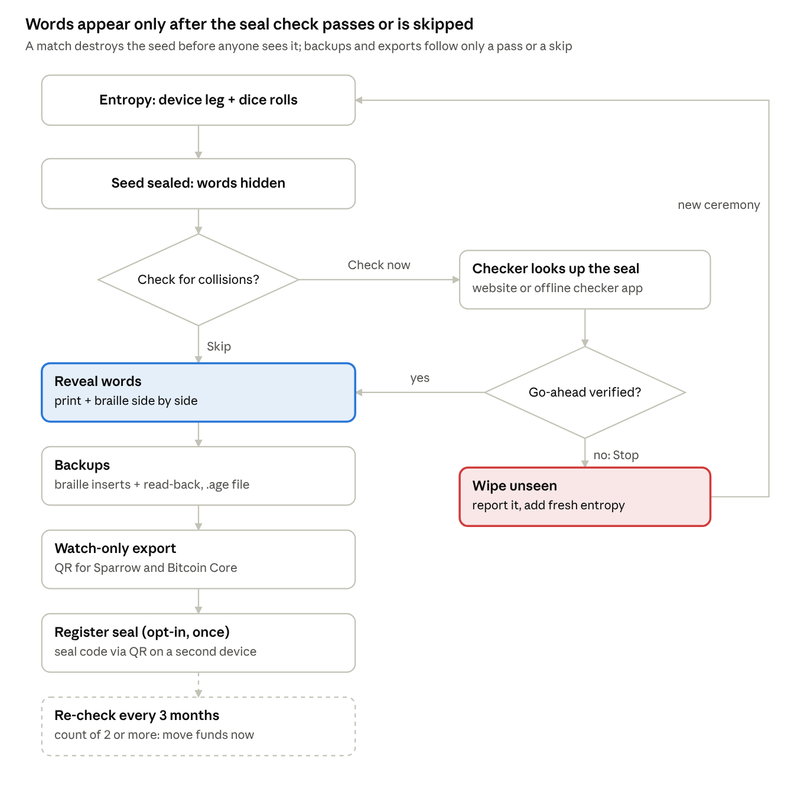

# Seal, watch-only and braille

## Overview

Three features finish the ceremony: a collision check that runs before any word is shown, a watch-only export for Sparrow and Bitcoin Core, and a braille copy of every seed backup. None of them weakens the seed, and none sends a secret off the device.

| Feature | What the user gets | Key decision |
| --- | --- | --- |
| Collision seal | A unique seal image and code for the new wallet, checked against a public registry before the words appear | Derived from the seed through a one-way hash, not from the public key, so sharing an xpub with Sparrow never lets anyone fake or link a seal |
| "Check for collisions" prompt | A cautionary step after entropy, before reveal: a match wipes the seed unseen and starts a new ceremony; once a check starts, the words appear only after the device verifies the checker's go-ahead | A colliding user never sees or exports the other wallet's words |
| Public registry | Lookup and opt-in registration of seal tags, plus later re-checks | Stores only one-way tags and counts; no addresses, keys, IP logs or accounts |
| Watch-only export | Account descriptor as an on-screen QR for Sparrow, Bitcoin Core and other descriptor wallets | Public keys only; never written as a file |
| Braille backup | Every word shown in print beside braille, laid out face by face for a KeepCrypt titanium insert, then read back from the metal | SeedBook\_01 format: grade 1, first five letters on faces 1–5, sequence number on face 6 |

**Braille reference.** The braille spec follows the KeepCrypt SeedBook\_01 (Braille) supplied by the owner, cross-checked against the official BIP39 list: its section counts, page ranges and sample word numbers all match.

## Ceremony order

The check sits between the dice and the first look at the words, so a duplicate seed is destroyed before anyone can write it down.



The core enforces the order by type: in the sealed state the mnemonic, the device value D, backups and the watch-only export do not exist as callable functions. Choosing "Check now" moves the session to a checking state that has no Skip: only a verified go-ahead reaches the words, and every other exit wipes the seed. Registration and re-checks come after the backups and never gate them.

## What a collision check can and cannot detect

The registry is a field-wide birthday test: it flags a broken generator only once enough seeds from that generator are registered to make two of them identical. It is an alarm for catastrophic failures, not proof that a seed is strong.

Expected number of identical pairs among n registered seeds drawn from a space of 2^k equally likely seeds, n(n−1)/2 ÷ 2^k:

| Effective seed space | 10,000 seeds | 100,000 seeds | 1,000,000 seeds | 10,000,000 seeds |
| --- | --- | --- | --- | --- |
| 32 bits (Milk Sad, LuBian class) | 0.012 | 1.2 | 116 | 11,600 |
| 40 bits (Coldcard Mk2/Mk3 estimate) | 0.00005 | 0.005 | 0.46 | 46 |
| 72 bits (Coldcard Mk4/Q/Mk5 estimate) | about 10^-14 | about 10^-12 | about 10^-10 | about 10^-8 |
| 128 or 256 bits (correct generator) | none | none | none | none |

**What this means.**

- A 32-bit generator is caught once about 100,000 of its seeds are registered. A 40-bit one needs millions. A 72-bit one is never caught this way.
- Real failures are rarely uniform: a stuck or constant RNG collides at once, which the registry catches immediately.
- Prevention stays the job of the entropy design: health tests, the two-leg combine, CI path tests and dice. The registry is the last tripwire, not the first defense.
- The model assumes every seed in the space is equally likely; Coldcard's per-device timer and UID inputs were not, so treat its rows as rough guides.

## Seal derivation spec

The seal has three layers: a private seal code only seed-holders can compute, a public seal tag stored in the registry, and a picture drawn from the tag. Two different seeds give the same code only if the seeds are identical.

```latex
S = \mathrm{PBKDF2\text{-}HMAC\text{-}SHA512}(\text{mnemonic},\ \texttt{"mnemonic"},\ 2048,\ 64)
\qquad
\text{code} = \mathrm{Base32}\big(\mathrm{HMAC\text{-}SHA256}(S,\ \texttt{"KCE/v1/seal"})[\text{first 130 bits}]\big)
\qquad
T = \mathrm{SHA256}(\texttt{"KCE/v1/seal-tag"} \,\|\, \text{code})
```

| Value | Definition | Who may see it |
| --- | --- | --- |
| S | The standard BIP39 seed with an empty passphrase, so a user's BIP39 passphrase wallet is never linked to the seal | Device only |
| Seal code | Top 130 bits of the HMAC, as 26 Crockford base32 characters (alphabet `0123456789ABCDEFGHJKMNPQRSTVWXYZ`), grouped 5-5-5-5-6 | The owner; sent only when registering. Anyone holding it can file a false collision report, so it is never posted publicly |
| Seal tag T | SHA-256 of the domain tag and the code's 26 ASCII characters, without the grouping dashes | Public; stored in the registry and safe to share |
| Seal ID | First 40 bits of T as 8 base32 characters | Public; printed under the seal image |
| Lookup prefix | First 5 hex characters (20 bits) of T | Sent in online lookups |

**Why not the public key, as first proposed.** Account public keys (xpubs) are routinely shared with Sparrow, Bitcoin Core and coordinators. A seal built from them would let anyone holding the xpub compute the code and fake collision reports, and would link the public registry entry to the wallet's addresses. Deriving from S keeps the seal unforgeable by outsiders and unlinkable to on-chain activity.

**Test vector** (checked with a standard-library Python script, which Claude Code turns into `vectors/seal.json`):

| Field | Value |
| --- | --- |
| Mnemonic | `abandon abandon abandon abandon abandon abandon abandon abandon abandon abandon abandon about` |
| S (first 16 bytes) | `5eb00bbddcf069084889a8ab91555681` (the official BIP39 vector) |
| Seal code | `JXP3R-DXYAC-JZ1NA-X3RGQ-DJCJJN` |
| Seal tag T | `2b8103c8dd64611df5c8c28b8fbf864a1005372f5da06a5777f92708ce79cb5c` |
| Seal ID | `5E0G7J6X` |
| Lookup prefix | `2b810` |

The offline verifier recomputes the code, tag and ID from the words, so a user can confirm the device showed an honest seal.

## The seal image

The seal image is a symmetric 8×8 pattern drawn from the public tag T, so it is safe to share and every honest tool draws the same picture. It helps people match a seal at a glance; the registry lookup itself always uses the full tag.

| Element | Rule |
| --- | --- |
| Grid | 8 rows × 8 columns; the left 4 columns come from bytes 1–4 of T (32 bits), read row by row, most significant bit first; the right 4 columns mirror the left |
| Colour | Filled cells use colour `T[0] mod 8` from the Okabe–Ito palette (`#000000`, `#E69F00`, `#56B4E9`, `#009E73`, `#F0E442`, `#0072B2`, `#D55E00`, `#CC79A7`), chosen to stay distinct for common colour-vision differences; every cell has a dark outline so light colours remain visible |
| Background | Light tile, whatever the app theme, so screenshots of the registry page and device photos match |
| Caption | Seal ID in large type beneath the grid, plus a braille rendering of the Seal ID for blind users |
| Sizes | 192 × 192 px on the Pi's 240 × 240 screen; 240 pt on phones; SVG on the registry website |

**Test-vector seal** (T above, colour index 3 = `#009E73`, `#` filled, `.` empty):

```text
#......#
...##...
........
..####..
##....##
#......#
##.##.##
##.##.##
            Seal ID 5E0G7J6X
```

The pattern carries only about 35 bits, so two different seals can occasionally look alike. Users compare the Seal ID text when it matters, and tools compare the full tag.

## Checking the seal

Right after the dice, and before any word is shown, the device offers the check. Two methods give the same answer; the offline snapshot is preferred because nothing at all leaves the device.

**The prompt** (Pi and phones, same words):

> **Check for collisions before you see your words?** KeepCrypt can compare this new wallet's seal with the public KeepCrypt registry. If anyone has ever registered the same seal, your seed is not unique: it will be destroyed without being shown, and you will make a new one. \[ Check now (recommended) \]   \[ Skip \]

|  | Offline snapshot (recommended) | Website or offline checker app |
| --- | --- | --- |
| How | Before the ceremony, download the signed daily snapshot `keepcrypt-registry-YYYY-MM-DD.kcr` on any computer. Load it from a USB stick (Pi) or the file picker (phone; works in airplane mode). The device verifies the signature and searches it | The device shows the seal card: seal image, Seal ID and a check QR. Scan it with the registry website on any online phone or computer, or with the offline checker app on a second device that holds a cached snapshot. Both draw the same seal image and answer Go ahead or Stop |
| What leaves the device | Nothing | Nothing from the device. The helper's browser sends only a 20-bit prefix of T |
| Freshness | As of the snapshot date, shown on screen; phones warn when it is older than 30 days, and the Pi, which has no clock, asks the user to confirm the date | Latest daily snapshot (website) or the cached snapshot's date (offline checker app) |
| Result entry | Automatic | Go ahead: the user types the 8-character go-ahead code, or a phone scans the go-ahead QR; the device verifies it before revealing. Stop: the user taps "Match found" |
| Needs | A USB stick or local file | A second device: online for the website, or holding a cached snapshot for the offline checker app |

**Snapshot format.** All integers are big-endian. Header, exactly 58 bytes: magic `KCR1`, format version (u16, = 1), snapshot number (u64), UTC date as the decimal number YYYYMMDD (u32), entry count (u64) and the bucket root (32 bytes). Then a pure Ed25519 signature (64 bytes) over exactly those 58 header bytes, checked against the registry key pinned in every app. Body: the entries, 18 bytes each, the first 16 bytes of T then a 16-bit registration count of at least 1, in strictly ascending tag order with no duplicates; at most 2^22 entries (75.5 MB). The bucket root commits to the body: a SHA-256 Merkle tree over all 2^20 buckets in prefix order, with leaf = SHA-256(0x00 ‖ `KCE/v1/bucket` ‖ the 20-bit prefix as 3 bytes ‖ that bucket's entries) and node = SHA-256(0x01 ‖ left ‖ right). The 20-bit prefix as 3 bytes is the bucket index as a 24-bit big-endian integer: a tag starting `2b810…` is in bucket `02 b8 10`. A loader recomputes the root from the body and rejects any mismatch. A million registrations is about 18 MB.

**Online lookup privacy.** The check QR encodes `https://<registry>/check#t=<T as 64 lowercase hex>&n=<n as 16 lowercase hex>`. The part after `#` is never sent to the server; the page's open-source script reads it locally, requests `GET /v1/proof/<first 5 hex of T>`, verifies the returned bucket against the signed snapshot header, and compares the tag in the browser. The server learns only 20 of the tag's 256 bits, a bucket shared by about one in a million of all registered seals. This is the same k-anonymity approach used by password-breach lookups.

### Go-ahead before reveal

The check is optional, but once the user chooses "Check now" it binds: the words appear only after the device verifies a go-ahead from a checker, and every other exit wipes the seed unseen. "Skip" is offered only before the check starts, so nobody can read a Stop on the website and then skip past it.

**The seal card.** The device shows the 8×8 seal image, the Seal ID and a check QR carrying T and a nonce n: 8 fresh random bytes from the core, used for this check only, so an old or borrowed result cannot be replayed.

**Who can answer.** Any copy of the open-source checking page: the registry website on an online phone or computer, or the offline checker app on a second device that holds a cached snapshot. A device that loaded a signed snapshot before the ceremony answers itself and needs no QR. The checker verifies the signed snapshot data, draws the seal image so the user can compare it with the device, and gives one answer:

| Checker answer | Checker shows | Device does |
| --- | --- | --- |
| Go ahead | "No collision for seal 5E0G7J6X as of \<date>", an 8-character go-ahead code and a go-ahead QR | Pi: the user types the code with the joystick. Phones, and a Pi with the phase-2 camera: scan the go-ahead QR or type the code. Once verified, the words are revealed |
| Stop | "Collision found for seal 5E0G7J6X. Do not use this seed." No code | The user taps "Match found": the seed is wiped unseen, a collision-report QR is shown, then "Add fresh entropy" |
| Cannot check | A network or snapshot error; no code | The user taps "Start again": the seed is wiped and a new ceremony starts |

**Go-ahead code.** G = the first 40 bits of SHA-256(`KCE/v1/go` ‖ T ‖ n), written as 8 Crockford base32 characters in two groups of four. The checker computes it only after it has verified the signed data and found no entry for T. The device recomputes G and compares in constant time; a typo can be re-entered. The code proves the checker looked up this exact seal during this ceremony. It does not prove the checker is honest, which is why the page is open source, served with Subresource Integrity, and verifies the registry signature itself. Test vector: the seal-vector T above with n = `0001020304050607` gives G = `CF94-BCAJ`.

**Go-ahead QR.** For devices with a camera, the checker also shows the signed evidence itself: the snapshot header and its signature, every entry in T's 20-bit bucket, and the Merkle path from that bucket to the signed bucket root. The device checks the signature against the pinned key, recomputes the root, confirms its T is not in the bucket, and applies the same snapshot-date rule as a loaded snapshot. This answer needs no trust in the checker, and the server still learns only the 20-bit prefix. The evidence, KCP1, is exactly `KCP1` ‖ the 58-byte snapshot header ‖ its 64-byte signature ‖ the bucket index (3 bytes) ‖ the entry count k (u16) ‖ the k entries ‖ the 20 sibling hashes of the Merkle path, leaf level first: 771 + 18k bytes. The QR is a single-part BC-UR `ur:keepcrypt-proof/…` whose CBOR is one byte string holding the KCP1 bytes. The device decodes it strictly, in this order: at most 4,296 characters (the largest QR alphanumeric capacity), checked before any decoding; all lowercase or all uppercase (QR alphanumeric mode gives `UR:KEEPCRYPT-PROOF/`), never mixed; the type `keepcrypt-proof` and exactly one part; minimal bytewords, then the CRC-32; a shortest-form, definite-length CBOR byte-string head, and nothing after the byte string. About 75 bucket entries fit one QR, and there are no animated frames.

**Add fresh entropy.** After a Stop, nothing from the destroyed seed is reused: the next ceremony takes a fresh device leg and fresh dice, its dice minimum rises to 99 rolls for either length, and the device suggests a verification run with the offline verifier, because a genuine collision means this device's randomness or firmware is suspect. After "Cannot check", the next ceremony uses the normal minimum, unless the session that could not be checked was itself the restart after a collision: the 99-roll minimum then stays until a check passes. Only "Add fresh entropy" and "Start again" carry it over; after Skip or any other wipe (an error, a timeout, power-off), a new ceremony uses the normal minimum.

**Results.**

- **Go ahead (verified):** "No collision for seal \<Seal ID> as of \<snapshot date>." The device verifies the code, the go-ahead QR or its loaded snapshot, then reveals the words.
- **Stop (match):** "Collision found. This seed is not unique and has been destroyed." The session is wiped unseen. The device offers a collision report (next section) and "Add fresh entropy", and suggests reporting the device and firmware version to the KeepCrypt security address.
- **Skip (only before a check starts):** the words are revealed with a note that the seal can be checked later from the words.

## Registration, re-checks and safety

Registration is opt-in and happens once, after the words are safely written down; re-checks are lookups only. A user who finds a collision never sees the matching seed, and the registry never holds anything that unlocks funds.

**Registering a new seal.** The device shows a "Register seal" QR encoding `https://<registry>/register#c=<the 26 seal-code characters, uppercase, no dashes>`. The helper page posts the code with a small proof of work. The server recomputes T, adds one to its count, and discards the code. The device reminds the user to register once only and never from a restored seed, because a second registration of the same seed looks like a collision.

**Count meaning:** 1 = only you; 2 or more = someone else registered the same seal (or you registered twice).

**Reporting a collision.** After a match, the device offers a "Report collision" QR with the destroyed seed's code. Registering it raises the count so the earlier owner's next re-check shows the alarm. Sharing the code is harmless because that seed is never used.

**Re-checking an existing wallet.** The verifier, the Pi's "Check a backup" tool and the phone apps compute the seal from the words or the encrypted backup, then look it up by snapshot or online. The online re-check QR encodes `https://<registry>/check#t=<T as 64 lowercase hex>` with no nonce, so the checker can show the registration count but never a go-ahead code. If the count is 2 or more and you registered once, move your funds to a new seed now. Re-check every 3 months and after any news of a weak-RNG wallet bug.

**Why a colliding user cannot reach the other wallet's funds.**

1. **Order of operations.** The check runs while the core session is in its sealed or checking state, where the mnemonic, D, the backup and the watch-only export are unavailable by type. A match wipes the session; there is nothing left to show or save.
2. **Nothing usable in the registry.** It stores and returns only tags and counts, never addresses, xpubs, seeds or codes.
3. **Collisions should be practically impossible.** In mixed mode, a repeat needs both the device leg and all 50 or 99 dice rolls to repeat. A match therefore means broken hardware or skipped dice, and the device says so.
4. **The honest limit.** A collision means two people hold identical secrets, and someone running modified firmware could skip the wipe. The registry does not create that risk: anyone able to reproduce that seed could already find it by enumerating the weak space against blockchain addresses. The registry's job is to warn the earlier owner quickly.

| Abuse case | Defence | Remaining impact |
| --- | --- | --- |
| Fake collision report | Reporting needs the seal code, which only the seed holder computes; public tags cannot be reversed into codes | Someone who saw your screen could cause a false alarm; you move funds to a new seed and lose nothing |
| Registry lies or hides entries | Append-only public log with signed tree heads and public mirrors; signed snapshots; anyone can recompute counts | A lie is detectable by anyone comparing mirrors |
| Dishonest firmware hides seed data in the seal code | The offline verifier recomputes the code from the words; verification runs compare it; registration stays optional | Users who skip verification must trust the firmware, as with any device |
| Attacker uses tags as a weak-seed oracle | Gives no more than watching addresses derived from a weak seed space | Earlier warning to the attacker of an unfunded weak wallet; the registry warns the owner too |
| Linking users to registrations | No IP logs, no accounts, first-seen dates rounded to the day; Tor Browser recommended for registration | Network-level observers outside the registry |
| Fake go-ahead | The go-ahead code is bound to this seal and a fresh nonce, so it cannot be guessed (1 in 2^40) or replayed from another check; the go-ahead QR and a loaded snapshot are verified on the device against the pinned key | A modified checking page could issue a code for a registered seal; use the go-ahead QR or a loaded snapshot when that matters |

## Registry service spec

The registry is a small open-source web service plus a static checking page. It is the only KeepCrypt component that touches a network, and it never handles seed words.

| Part | Specification |
| --- | --- |
| Code location | `registry/server` (Rust, axum, SQLite) and `registry/web` (static TypeScript page, no third-party scripts, strict Content-Security-Policy, Subresource Integrity) |
| Stored per seal | Tag T (32 bytes), registration count, first-seen date rounded to the day |
| Never stored | Seal codes (discarded after hashing), IP addresses, user agents, accounts, cookies; the reverse proxy runs with access logs off |
| `GET /v1/proof/{5 hex}` | Every tag sharing that 20-bit prefix with its count, the Merkle path from that bucket to the bucket root, and the signed header of the latest snapshot; precomputed daily as static files and padded to a fixed size so their length reveals nothing |
| `POST /v1/register` | Body: seal code and proof-of-work nonce. Rejects non-canonical codes; computes T; increments count; appends a log entry; returns the new count |
| Abuse control | Proof of work tuned to about 2 seconds in a browser, plus a global rate cap; no per-IP limits because IPs are not kept |
| `GET /v1/snapshot/latest` | The daily signed `.kcr` snapshot, also published to mirrors |
| Transparency | Append-only Merkle log of (T, day) entries with signed tree heads (for example the C2SP tlog-tiles layout); counts are recomputable from the log |
| Signing key | Ed25519 key kept offline, pinned in the apps; rotation by a statement signed with the old key |
| Checking page | Reads `#t=`, `#n=` or `#c=` from the URL fragment only; verifies the signed header and bucket proof in the browser; draws the seal image from T; shows the go-ahead code and go-ahead QR only for a verified no-match; never shows an input box for seed words, and says so |
| Offline checker app | The checking page installed as an offline web app (service worker) on a second phone or computer. It caches the page and the latest signed snapshot, verifies the signature, then answers checks in airplane mode with the same go-ahead code and go-ahead QR |

**Milestone.** The service, the proof files and the offline checker app are milestone M9. The apps build and test their snapshot loader, go-ahead entry and QR screens against a local test registry from M3 onward.

## Watch-only export

After the backups, the device shows the wallet's public account data as QR codes, so Sparrow, Bitcoin Core or another descriptor wallet can watch balances and build unsigned transactions. Nothing private is exported, and nothing is written as a file.

| QR | Contents | For |
| --- | --- | --- |
| Account QR | BC-UR `crypto-account` with master fingerprint and the BIP84 account key `m/84'/0'/0'` | Sparrow's airgapped-device Scan and other UR-capable coordinators |
| Descriptor QR | Two plain-text output descriptors with checksums, receive and change | Bitcoin Core and any descriptor wallet |

**Descriptor format** (native SegWit by default; checksums computed by the core):

```text
wpkh([<fingerprint>/84h/0h/0h]<xpub>/0/*)#<checksum>
wpkh([<fingerprint>/84h/0h/0h]<xpub>/1/*)#<checksum>
```

**Sparrow.** New wallet → single signature, native SegWit → Airgapped Hardware Wallet → Scan the account QR (or xPub / Watch-Only Wallet → QR) → Apply.

**Bitcoin Core** (scan the descriptor QR on the computer):

```bash
bitcoin-cli createwallet "keepcrypt-watch" true true   # no private keys, blank
bitcoin-cli -rpcwallet=keepcrypt-watch importdescriptors '[
  {"desc":"wpkh([fp/84h/0h/0h]xpub.../0/*)#checksum","timestamp":"now","active":true,"internal":false},
  {"desc":"wpkh([fp/84h/0h/0h]xpub.../1/*)#checksum","timestamp":"now","active":true,"internal":true}]'
```

**Rules.**

- Confirm the first receive address in Sparrow or Core matches the device's wallet summary before funding.
- If the user adds a BIP39 passphrase, the device asks for it before export and exports that wallet, showing its own fingerprint and first receive address; the first address in Sparrow or Core is then compared with that one, not with the wallet summary.
- An xpub reveals every address and balance; the screen says to treat it as private.
- Taproot (BIP86) export is a later option; v1 ships native SegWit only.
- Milestone gates M4–M6 include a real import into the current Sparrow and Bitcoin Core releases; the UR type is confirmed against Sparrow at that point.

## Braille backup

Every KeepCrypt backup is also a braille backup in the format of the KeepCrypt SeedBook\_01: each BIP39 word in print beside Unified English Braille grade 1, one cell per letter, no contractions. The device lays each word out exactly as it goes onto a KeepCrypt titanium insert, then makes the user read the metal back before the session ends.

**The KeepCrypt metal format** (from the SeedBook, checked against the official BIP39 list):

| Element | Rule |
| --- | --- |
| Storage | One hexagonal titanium insert per word. A KeepCrypt Hinge (4-inch butt hinge, titanium Gr2 pin) or Screw (M10 fastener, sealed cavity) holds 12 inserts: one complete 12-word phrase |
| Faces 1–5 | The first five letters, one cell per face. Each face is pre-etched with six blank rings; the punch raises the chosen dots, read as printed with dot 1 at top-left |
| Face 6 | The pre-engraved sequence number 01–12, which is the word's position in the phrase |
| Short words | Three- and four-letter words leave the remaining faces blank, and a blank face is part of the backup. ACT (0020) is a, c, t, blank; ACTION (0021) is a, c, t, i. 49 short words are prefixes of longer ones in this way |
| Letters 4 and 5 | The first four letters identify every one of the 2,048 words; the fifth is a redundancy check, printed lighter in the SeedBook |
| SeedBook number | The word's position in the official list, 0001–2048 (1-based; some software counts from 0). Shown only to find the word in the SeedBook; never backed up in place of the word |
| Mirror pairs | e/i, d/f, h/j and r/w are left-right mirror images, and the only such pairs in the alphabet. Read them twice |

**Cell alphabet** (identical to the SeedBook; Unicode braille patterns, U+2800 block):

```text
a ⠁  b ⠃  c ⠉  d ⠙  e ⠑  f ⠋  g ⠛  h ⠓  i ⠊  j ⠚
k ⠅  l ⠇  m ⠍  n ⠝  o ⠕  p ⠏  q ⠟  r ⠗  s ⠎  t ⠞
u ⠥  v ⠧  w ⠺  x ⠭  y ⠽  z ⠵
numbers: number sign ⠼ (dots 3-4-5-6), then a=1 b=2 c=3 d=4 e=5 f=6 g=7 h=8 i=9 j=0
         BIP39 words never need it; passphrases and dates do (2026 = ⠼⠃⠚⠃⠋)
         a letter a-j right after a digit takes the grade 1 indicator ⠰ (dots 5-6), so it is not
         read as a digit; a letter k-z, a space or a hyphen ⠤ ends the digits
         (Seal ID 5E0G7J6X = ⠼⠑⠰⠑⠼⠚⠰⠛⠼⠛⠰⠚⠼⠋⠭)
```

This is standard UEB grade 1 for digits next to letters. Letters are lowercase, and any character outside a–z, 0–9, space and hyphen is refused in v1. The SeedBook's shorter rule, that any letter ends the number, would make ⠼⠑⠑ read as 55 rather than 5E. A braille reader confirms this before release.

**Insert view examples** (positions are illustrative):

| Insert | Word | SeedBook | Face 1 | Face 2 | Face 3 | Face 4 | Face 5 |
| --- | --- | --- | --- | --- | --- | --- | --- |
| 01 | abandon | 0001 | ⠁ a | ⠃ b | ⠁ a | ⠝ n | ⠙ d (lighter) |
| 02 | act | 0020 | ⠁ a | ⠉ c | ⠞ t | blank | blank |
| 03 | metal | 1121 | ⠍ m | ⠑ e, mirror pair | ⠞ t | ⠁ a | ⠇ l (lighter) |

**On screen.** After the collision check, the device shows one word at a time in insert view: the sequence number, the word with its SeedBook number, and five large face cells with numbered dots. Letters past the fourth are drawn lighter, blank faces show empty rings labelled "leave blank", and mirror-pair letters are flagged. An overview of four words per page is available for the paper copy. All protected-screen rules apply.

**Read-back from the metal (mandatory).** Before the session ends, the user reads every punched insert in order and enters the first four letters of each word. The device completes each word and compares it with the seed it still holds, so any misread is caught. This is the SeedBook's "whole phrase test-restored from the metal" step, done without a second device. It matters because 279 BIP39 words are one mirror-pair flip away from another word's first four letters (ACCESS and ACCIDENT differ only by e and i), and on a later restore the 12-word checksum would miss about 1 such error in 16. The core enforces this step: it refuses the five exports, `generate_backup_passphrase`, `encrypt_backup`, `watch_only`, `registration` and `reveal_device_leg` (the backup passphrase, the encrypted backup, the watch-only export, the registration and D), until every word has read back correctly.

**Before you walk away** (the SeedBook checklist, shown as the final screen): every face read back; inserts reassembled in sequence order, 01 first; device fastened shut and back in place; whole phrase test-restored from the metal; every paper copy destroyed; no photograph of the inserts anywhere.

**24-word seeds** need two 12-insert devices, and both insert sets are engraved 01–12. Words 1–12 go on device 1 of 2 and words 13–24 on device 2 of 2, inserts 01–12, and the core labels each insert with its device and sequence number. Every insert screen, the read-back prompt and the final checklist say which device holds words 1–12, and KeepCrypt marks the second device physically.

**Inside the encrypted backup.** The plaintext includes a `braille:` line per word: the two-digit position, then the whole word in cells (every letter, not only five), so a blind user who decrypts it with `age` can read it on a refreshable braille display.

**Accessibility.** On phones, words can be read through VoiceOver or TalkBack on a refreshable braille display; speech output is allowed only with headphones and an on-screen warning. Android's sensitive-data flag still lets genuine accessibility tools read the words. Driving a USB braille display from the Pi is a later option.

**Tests and cross-checks.** The core's `braille` module produces faces, blanks, SeedBook numbers and mirror flags for all 2,048 words (`vectors/braille.json`). Checked for this spec: the SeedBook's 25 section counts (total 2,048), its page ranges 001–098, and the sample numbers ABANDON 0001, ACT 0020, METAL 1121, WIRE 2018 and ZOO 2048 all match the official list. Before release, a braille reader proofreads punched sample inserts against the SeedBook.

**SeedBook safety rules, enforced in the copy on screen.** The SeedBook is a public reference: never write the real phrase in it or store a marked copy with the wallet. Work one word at a time, in order, alone and offline; rehearse on a spare insert first. Never use a computer-driven embosser or printer for a real seed.

**Your Tetris idea, kept.** The waiting-screen Tetris can show braille letters on its blocks as a teaching aid. Those letters come from the game's own RNG, never from the entropy pool.

## Sources

- [BIP39 specification and English wordlist](https://github.com/bitcoin/bips/blob/master/bip-0039.mediawiki) (wordlist SHA-256 `2f5eed53a4727b4bf8880d8f3f199efc90e58503646d9ff8eff3a2ed3b24dbda`, used for the braille checks)
- [Sparrow Wallet features: output descriptors, UR QR codes, xpub watch-only keystores](https://sparrowwallet.com/features/)
- [Blockstream: importing an airgapped xpub into Sparrow by QR](https://help.blockstream.com/blockstream-jade/use-jade-with-third-party-apps/use-jade-qr-scan-with-sparrow.md)
- [Learning Bitcoin: watch-only descriptor wallets in Bitcoin Core](https://learningbitcoin.blockchaincommons.com/04_2_Integrating_Addresses_Descriptors/)
- [age v1 specification (C2SP)](https://age-encryption.org/v1)
- KeepCrypt SeedBook\_01 (Braille): the full BIP39 word list cell by cell, the insert format and the punching procedure; supplied by the owner (keepcrypt.com, a Bitwill company)
